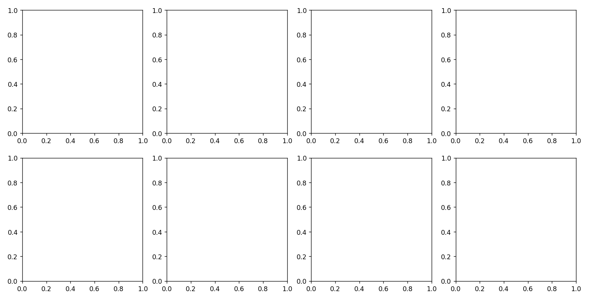
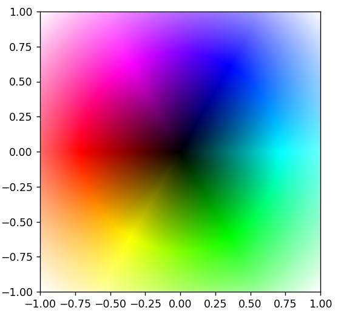
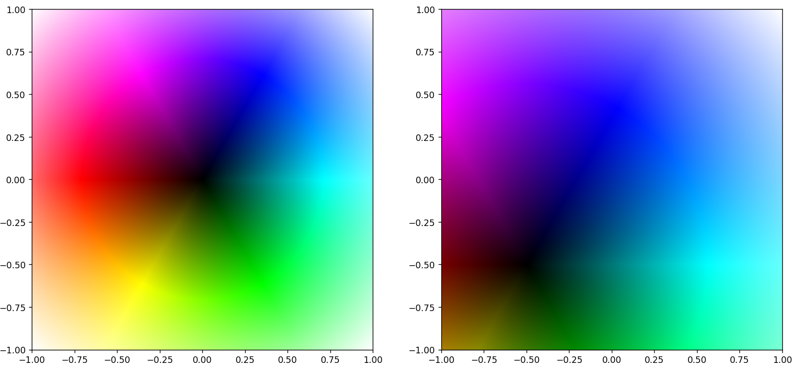
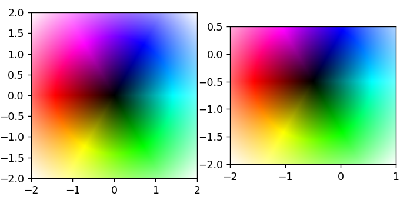
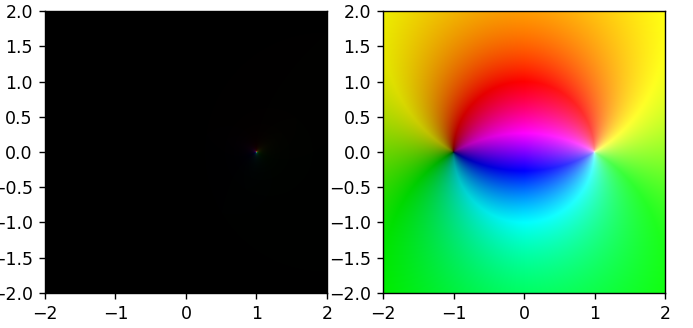

# GraphesComplexes

Bibliothèque Python pour manipuler et analyser des fonctions complexes, avec des transformations et des masques spécialisés.

---

## 📦 Installation

Copiez-collez ce code dans votre invite de commande pour installer le package. En cas de problème : https://docs.python.org/fr/dev/installing/index.html

```bash
pip install GraphesComplexes
```

Ensuite dans vos fichiers python il faut importer le module :
```python
import GraphesComplexes as gc # Utilisation : gc.objet (Recommandé)
from GraphesComplexes import * # Utilisation : objet (Variante)
from GraphesComplexes import objet # Utilisation : objet (Idem, mais ici vous ne pouvez utiliser que 'objet')
```

## Utilisation
### Créer et manipuler des fonctions
#### Création de fonction
Pour creer une fonction utilisable par la bibliothèque, il faut tout d'abord la définir puis la renter en argument lors de la création de l'objet :
```python
def fonc(z):
    return z**2+1j*z-1
f = gc.Fonction(fonc)
```
Vous avez ici créé la fonction $z\mapsto z^2+iz-1$
Pour les fonctions simples comme celle-ci, il est plus simple et élégant de passer par un ```lambda``` :
```python
f = gc.Fonction(lambda z: z**2+1j*z-1)
```
Le résultat est le même, si ce n'est un code plus propre et moins lourd.
#### Manipulation des fonctions
Vous pouvez réaliser les principales opérations sur les fonctions :
```python
f = gc.Fonction(lambda z: z**2+1j*z-1)
g = gc.Fonction(lambda z: 1/z)
f(3)
f+g
f-g
f*g
f/g
f**2
f@g
g.composéePuissance(3)
```
Ce qui correspond à :
```math
\begin{center}
\begin{aligned}
f:z\mapsto z^2+iz-1 \\
g:z\mapsto \frac 1z \\
f(3)=8+3i \\
f+g = z\mapsto z^2+iz-1+\frac 1z \\
f-g = z\mapsto z^2+iz-1-\frac 1z \\
fg = z\mapsto z+i-\frac 1z \\
\frac fg = z\mapsto z^3+iz^2-z \\
(f)^2 = ff = z\mapsto z^4+2iz^3-3z^2+2iz+1 \\
f\circ g= z\mapsto \frac 1{z^2}+i\frac 1z-1 \\
g^3 = g\circ g\circ g = z\mapsto\frac 1z
\end{aligned}
\end{center}
```

### Représenter les fonctions sur le graphe
#### Créer un graphe
La classe graphe ne crée pas vraiment *un* graphe mais un ensemble de graphes; autant que vous en voulez. Renseignez en ```x```,``` y``` le nombre de lignes et de colonnes de graphes que vous souhaitez. Par défaut il n'y a qu'un seul graphe de créé.
```python
graphe0 = gc.Graphe() #Crée 1 graphe
graphe1 = gc.Graphe(3) #Crée 3 graphes sur une seule colonne
graphe2 = gc.Graphe(1, 3) #Crée 3 graphes sur une seule ligne
graphe3 = gc.Graphe(2, 2) #Crée 4 graphes, deux par lignes et colonnes
graphe4 = gc.Graphe(2, 4) #Crée 8 graphes, 4 par lignes sur 2 colonnes
```
#### Afficher un graphe
Ici, rien de plus simple, il suffit d'appeler la méthode ```Graphe.affiche()``` :
```python
graphe4.affiche()
```
Voici, par exemple, le rendu de graphe4.


#### Dessiner des fonctions
Il est temps de dessiner ces fameuses fonctions complexes ! Il faut pour celà utiliser la méthode ```Graphe.tracer()``` qui prend en paramètre la fonction qu'on le veut tracer.
Traçons la fonction identité :
```python
gph = gc.Graphe() # 1 seul graphe suffit ici
id = gc.Fonction(lambda z:z)

gph.trace(id)
gph.affiche()
```
Résultat :

On reviendra sur la construction et la lecture des images plus tard.

Si vous avez plusieurs graphes, il faut renseigner sur quel graphe vous tracer dans le fonction ```Graphe.tracer``` :
```python
gph = gc.Graphe(1, 2)
id = gc.Fonction(lambda z:z)
aff = gc.Fonction(lambda z:z+0.5+0.5j)

gph.trace(id, 0, 0)
gph.trace(aff, 1, 0)
gph.affiche()
```

Les deux paramètres suivant sont un facteur d'échelle et les bornes d'affichage du graphe :
```python
gph = gc.Graphe(1, 2)
id = gc.Fonction(lambda z:z)
aff = gc.Fonction(lambda z:z+0.5+0.5j)

gph.trace(id, 0, 0, tailleMult=2)
gph.trace(aff, 1, 0, taille=(-2, 1, -2, 0.5))
gph.affiche()
```

Ici la fonction identité est affichée sur [-2, 2]² et la fonction affine sur [-2, 1]x[-2, 0.5].

Le dernier paramètre est la résolution. En principe pas besoin de le changer sauf si vous voulez changer la qualité de l'image ou améliorer les performances de votre pc.
```python
gph = gc.Graphe(1, 2)
id = gc.Fonction(lambda z:z)

gph.trace(id, 0, 0)
gph.trace(id, 1, 0, res=50)
gph.affiche()
```


#### Fonctions fournies
Des fonctions usuelles et certaines spéciales sont fournies avec la bibliothèque.
Sont présentes : ```id```, ```inv```, ```sin```, ```cos```, ```exp```, ```Log```, ```D2H```, ```H2D```.
```id``` est la fonction identité et ```inv``` est la fonction inverse.
```Log``` est le logarithme principal dans $\mathbb C$ : $\text{Log}(z) = \ln(|z|)+i\arg(z), \arg(z)\in[-\pi, \pi)$.
Les fonctions ```D2H``` et ```H2D``` correspondent aux bijection du disque unité $\mathbb D$ au demi-plan de Pointcarré $\mathbb H$.

Ensuite se trouve une liste de 5 fonctions de test que vous pouvez vous servir : ```fonctions_test```

Certaines fonctions à paramètres peuvent être générés par des fonctions de la bibliothèque :
- ```z_p``` génère le monôme $z^p$ :
```python
z3 = gc.z_p(3)
inv2 = gc.z_p(-2)
sqrt = gc.z_p(0.5)

gph.trace(z3) # Ok
gph.trace(z_p(5)) # Ok
gph.trace(z_p) # Erreur !
```

- ```bijD``` génère toutes les automorphismes de $\mathbb D$ : $z \mapsto e^{iθ}\frac{z-a}{1 - \bar a}$. Prend ```a``` et ```θ``` en arguments.

- ```bijH``` génère toutes les automorphismes de $\mathbb H$ : $z \mapsto \frac{az+b}{cz+d}$. Prend ```a```, ```b```, ```c``` et ```d``` en arguments.

- ```serieDirichlet``` génère la série de Dirichlet associée à ```a(n)``` et ```l(n)``` jusqu'à ```N``` termes : $z\mapsto \sum a_ne^{z\lambda_n}$

- ```serieDirichletn2``` génère la série de Dirichlet associée à ```a(n)=1``` et ```l(n)=n**2``` jusqu'à ```N``` termes avec un changement de variable logarithmique : $z\mapsto \sum z^{n^2}$